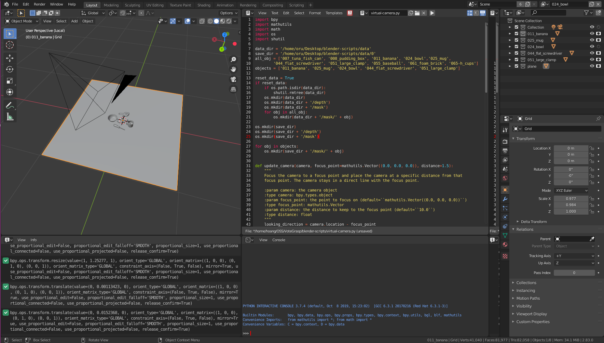
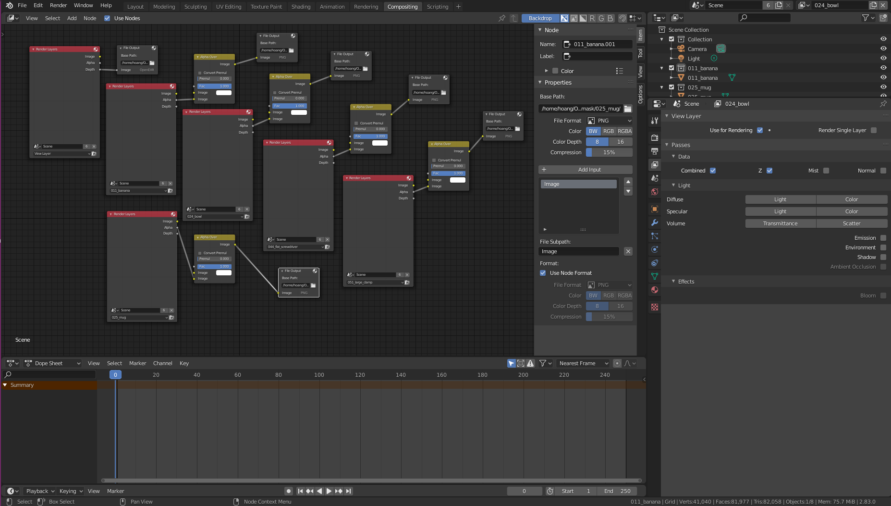
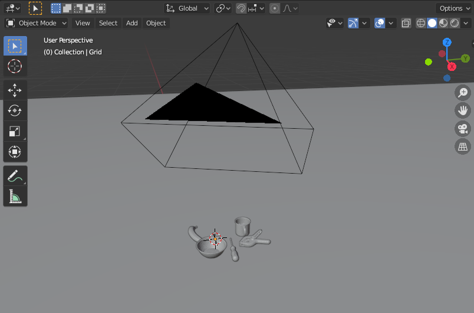

# Blender scripts for capturing depth images of a scene

The scripts were tested on [Blender 2.83](https://download.blender.org/release/Blender2.83/)  

You can change directories in compisiting to specify where to save depth mask and depth images.

